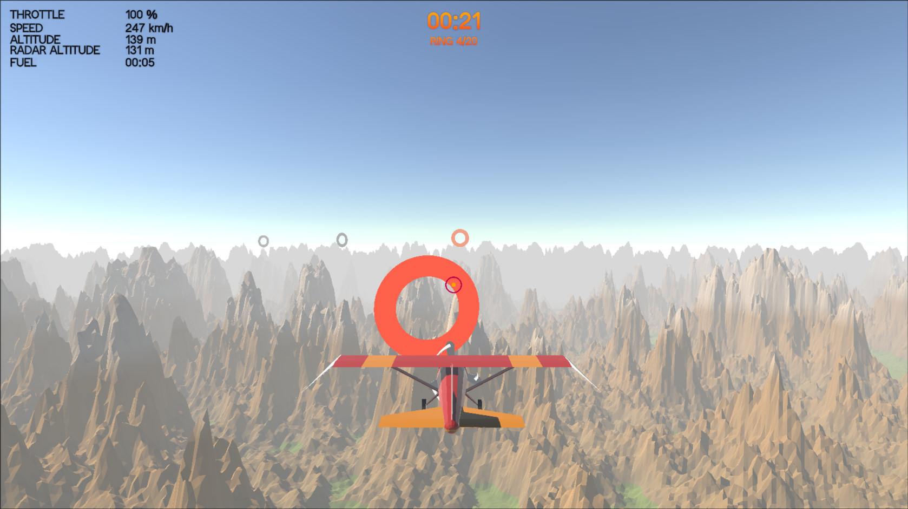

<h1>SkyboundRings</h1>

<blockquote><b>Warning:</b> Built in under 3 days and completely unoptimized. Expect potential memory leaks and rough edges!</blockquote>

This project is a Unity game built for the <b>KMUTT</b> university final project of the <b>MDT_12102</b> subject.

<a href="https://github.com/PaleHazeGuy/SkyboundRings_MDT12102/releases/tag/v1.0.0">Click Here To Download</a>
___

<h3>Controls</h3>
<ul>
  <li><b>Mouse Aim:</b> Point to steer the aircraft</li>
  <li><b>W / S:</b> Pitch (Nose Up / Down)</li>
  <li><b>A / D:</b> Roll (Bank Left / Right)</li>
  <li><b>E / Q:</b> Yaw (Rudder Left / Right)</li>
  <li><b>Left Shift / Left Ctrl:</b> Throttle Up / Down</li>
</ul>

___

<h3>Quick Gameplay</h3>

Hit <b>Play</b> and steer through the rings to survive! Your fuel is constantly draining. Passing through a ring refills your fuel tank to keep you flying. If your fuel runs out or you crash into the floor, you die. Clear all rings to win.

 

___

<h3>Made by 68120501042</h3>